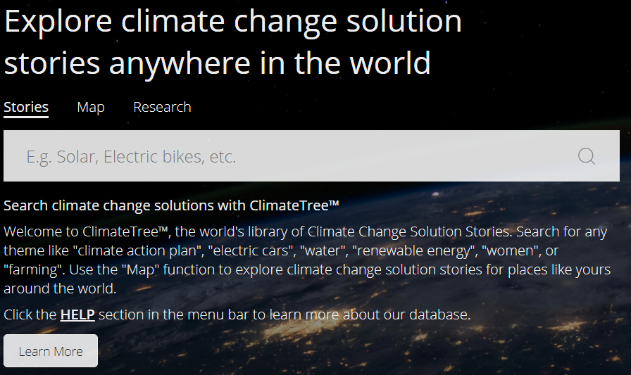
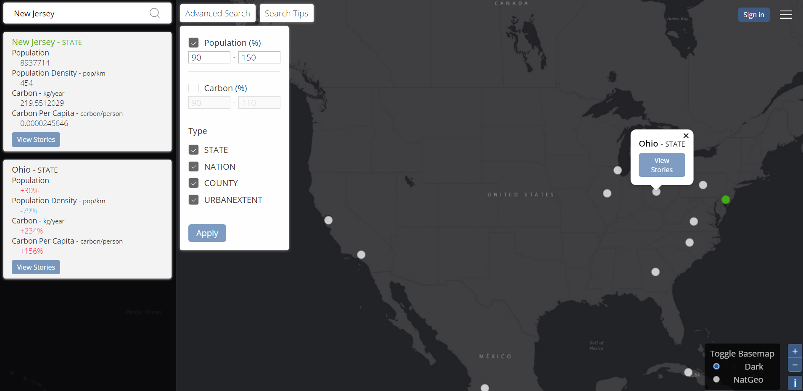

## Climate Tree Analysis
[Climate Tree](https://www.climatetree.wiki/)

I was first introduced to Climate Tree during the GIS Workshop course I had taken in the Spring of 2019. Although back then it was called, Truth Tree. My group had 5 budding developers, data enthusiasts, and GIS students and we were given one of the most ambitious projects to work with and the most interesting client to work for. While many groups got to work with a local government agency, like Seattle Parks, or small companies, we were paired with a man. That man was Greg Schundler, and Greg had big ideas. He wanted our project to save the world, quite litterally, from climate change. His hope was a project that would act as a kind of compendium or all climate related information and give insight into how we can adapt out methods of tackling climate change in local communities. 

Now, to this day I'm not really even sure how Greg had connected with UW, or Suzanne, who was the head of the class. They may have known each other through academic circles as Greg has been around the country and world. Our project really was only associated with him and he reported only to himself. Now, my team did not develop Climate Tree. This project was initially headed by a team of graduate students at Northeastern University, which Greg had also recruited. My team at UW examined this project as a guide for our own that quarter called Unite, so examining it gave us ideas on how we would like to proceed with our own. The goals of the projects were similar, to tackle climate change by using big data. 

Since I worked on the project from UW's GIS Workshop, what we called Unite, the team at Northeastern University has put more work into Climate Tree and there is more progress happening. Greg Schundler has organized Climate Tree as a part of Democracy Labs, which is a Seattle non-profit that specializes in building online infrastructure to empower the technology for good movement. Developers and contributers can see a catalog of projects and get connected to fascinating and helpful projects through Democracy Labs. In this essay I will look more in depth at Climate Tree, it's design, architecture, and use of data to learn from it's application of GIS in website design. 

Climate Tree's latest rendition opens up to advertise three key features on the website, Stories, Maps, and Research. Stories are one of the focal points of the site because the hope is that users will crowd source successful mitigation strategies for Climate Change to the website. The user can upload their story or search for others. These stories and ideas could be used to inspire communities, activists, or policy makers to take action and implement those ideas in their own lives. The map feature lets users search for their city or an area they would like to research and finds areas that are similar to it. The research and map tools I have some experience building as these were both features my team tryed to put into Unite last year. The Research tab helps users to find climate change solution stories so that they can then source them into Climate Tree's database. 

The Stories feature of Climate Tree was built using Javascript on the front end to send the inputted stories to a backend that used the database MongoDB. This is a cloud based database that is relatively easy to put onto front ends. According to the Mongo website it is document based, this means that it is not a completely strict structure and uses more of a "key and value" storage message. Something similar which we have seen in this class is JSON. My assumption is that one "document" in this project would be a climate success story which would be associated with the author, link, poster and other details relevant to that story.  This same database would then be called out to by the Javascript when a user requests a story on the front end client. The front end client of this website uses React. React is a open source Javascript library that helps users route data to the front end quickly and neatly. It is not something I have used personally but it is widely accepted as a userful tool in building web applications.

The map of this website is very similar in its use case and data than the project Unite, which I had worked on. The functionality lets you search for a location, and then using statistics about your searched location it finds places that are similar in population and population density, but with lower carbon emissions. The idea here to to give example of similar places that are handling climate change in a better way. These places could be good examples or give insight into local changes that could be made. When I worked with this location statistic data, it was supplied to us by Greg Schundler in a CSV format. We approached storing and using the data differently than the creators of Climate Tree, likely in a worse way. For Unite, my team first put the data into QGIS. Then we mapped the coordinates and fields into an appropriate GeoJSON output that we could use. We exported that GeoJSON and put the flat GeoJSON into our repository. We would then parse the GeoJSON in plain JavaScript. This proved to be slow but as we were novices we didnt find a better solution. Now, the group creating Climate Tree had a better solution in using GeoServer, this is also an open source platform, a Java based solution to store Geo based information. After looking through that section of their large Github repository I assume they put the data into GeoJSON as well or just put the csv for the location statistics directly into the GeoServer they hosted. How this works is when a location is searched by the client the Javascript reaches out to an API that fetches data from the GeoServer. This is much more efficient than the solution that my team came up with because our code went through the data in an unsorted fashion. All of the processing was happening on the front-end which means every time a call was made it would have to look through a world's worth of data, and at the client's expense. What the team at Northeastern University had done was make the data be processed on the back-end, the server-side. When the API call is made the data is processed in the cloud by the hosted server. That way the work load of the whole application is balanced better between the front end client and the back end. This makes the whole application much faster.

The front end of the map is quite easy to navigate. After searching a city, state, or country, the location is highlighted on the map and the population and carbon emission data is shown on the left hand panel. Other locations are also highlighted on the map. These are the similar places. If they are clicked their data is also shown on the panel and difference between them and the initially searched location is shown. All of the data for these maps is being pulled through Javascript API calls to the GeoServer and then put onto the map. The data being pulled relevant to the locations is 100% vector data, simply points for each place. However the base maps in use are technically raster. These are actually switchable. In the bottom right there is an option given to toggle between Dark and NatGeo. The tiles for these basemaps are being pulled from the GeoServer as well. They were initially loaded there using ArcGIS software as they are attributed there in the GitHub.

All in all I think this website does a good job at creating a platform that lets people share climate solutions in a fascinating way. The key is building a userbase that can populate the story feature with climate solutions. Ideally I could look up any place and see solutions, but the way the database currently is it requires the user to do the research themselves. If there was an incentive given to people for contributing stories and research I could really see this site taking off. Maybe it would be gamified. Then people would be populating the stories and the solutions would be easier to find for the users that actually plan on making a difference in the real world.

### Sources:
GeoServer. (n.d.). Retrieved June 06, 2020, from http://geoserver.org/
The most popular database for modern apps. (n.d.). Retrieved June 06, 2020, from https://www.mongodb.com/
Schundler, G. (n.d.). Climate Tree. Retrieved June 06, 2020, from https://www.climatetree.wiki/
DemocracyLab. (n.d.). Retrieved June 06, 2020, from https://democracylab.org/
Climate Tree. (n.d.). Retrieved June 06, 2020, from https://github.com/climatetree/

